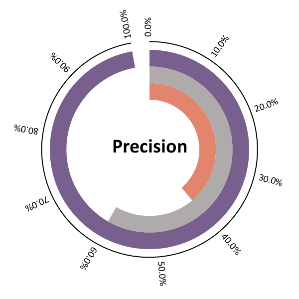
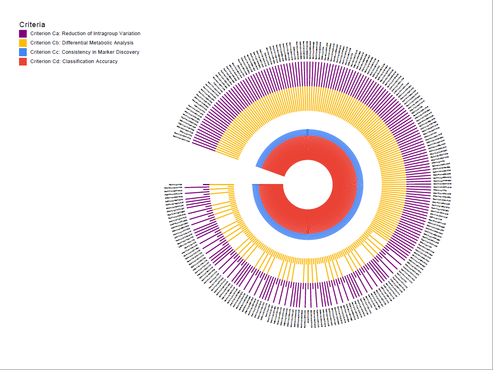

# 概述
该包包含了一些可视化功能，可以添加下列maven依赖使用它
```xml
    <repositories>
        <repository>
            <id>github</id>
            <url>https://maven.pkg.github.com/gcs-zhn/jvision</url>
            <snapshots>
                <enabled>true</enabled>
            </snapshots>
        </repository>
    </repositories>
    <dependencies>
        <dependency>
            <groupId>top.gcszhn</groupId>
            <artifactId>jvision</artifactId>
            <version>1.0</version>
        </dependency>
    </dependencies>
```
同时github的maven registry要求[登录认证](https://cwiki.apache.org/confluence/display/MAVEN/DependencyResolutionException)，即只允许github用户下载，不像maven中央仓库无需注册即可下载。具体配置有[官方文档](https://docs.github.com/cn/packages/working-with-a-github-packages-registry/working-with-the-apache-maven-registry)，主要是在`settings.xml`中配置server，注意token不是登录密码，需要自行创建，[快捷链接](https://github.com/settings/tokens)。
```xml
  <servers>
      <server>
      <id>github</id>
      <username>你的github账号</username>
      <password>你的github创建的具有下载package权限的token</password>
    </server>
   </servers>
 ```
例如下面是绘制示例环形统计图
```java
import top.gcszhn.jvision.RingDiagram;
public class Test {
    public static void main(String[] args) {
        float[] valueRange0 = new float[]{0.5f, 1f};
        RingDiagram ringDiagram0 = new RingDiagram(
            "Precision", 
            150, 
            150, 
            0.0f, 
            new float[]{26, 50}, 
            valueRange0, 
            90, 
            -350, 
            (valueRange0[1]-valueRange0[0]) / 10);
        ringDiagram0.loadData("sample/data-precision-MAST.csv");
        ringDiagram0.draw("sample/data-precision-MAST.png");
    }
}
```

CircularHistogram


